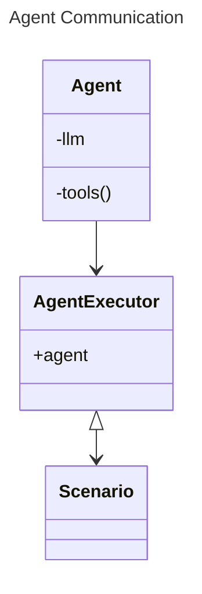

# Agent Communicaton

## Architecture based on Component Design

```mermaid
---
title: Agent Communication
---
classDiagram
    class Agent{
        -llm
        -tools()
    }
    class AgentExecutor{
        +agent
    }
    class Scenario{
    }

    Agent --> AgentExecutor

    AgentExecutor <|--> Scenario
```